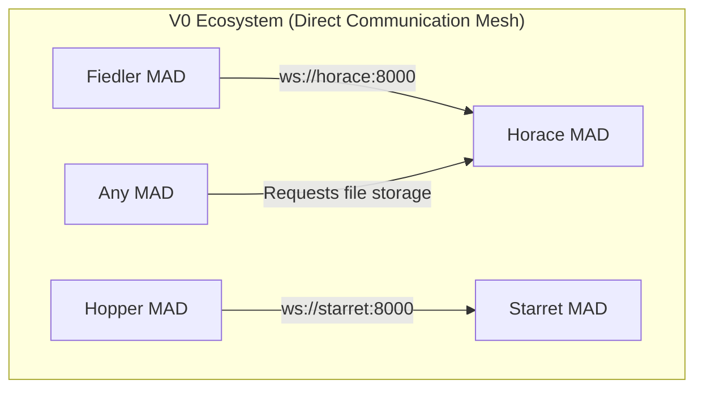
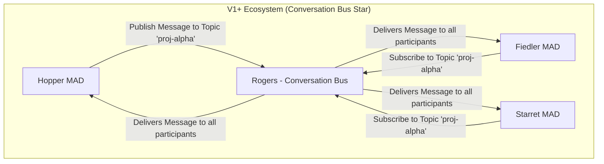

# Joshua System Architecture Overview

**Version**: 1.0 (Unified)
**Status:** Authoritative

---

## 1. Overview

The Joshua ecosystem is a conversational, self-evolving system built on two core philosophies: the **12-Factor App methodology** (see **ADR-027**) and the **Cellular Monolith** architectural pattern. This combination ensures that all components (MADs) are designed for scalability, resilience, and maintainability, while emerging from a shared architectural foundation.

The system is designed to evolve. It begins with a practical foundation (**V0: Direct Communication**) and progresses to a highly sophisticated, loosely-coupled, and observable target state (**V1+: Conversation Bus**). This document provides a high-level overview of this evolution, setting the stage for deeper dives into specific architectural topics.

## 2. Key Architectural Patterns (Common to All Versions)

### 2.1. Cellular Monolith

Inspired by biological systems, the Cellular Monolith architecture ensures that every MAD shares a common design pattern, cognitive structure, and communication protocol. This "Common DNA," which defines the evolutionary path and framework integration for all MADs, is formally specified in **ADR-002**.
-   **Shared Foundation**: All MADs instantiate from the same architectural template, ensuring natural integration and system-wide coherence.
-   **Specialization**: MADs specialize in distinct domains (e.g., data, security, development) through their unique Action Engines and configuration, not by having different underlying architectures.
-   **Unified Evolution**: Improvements to the core MAD template or communication protocol benefit the entire ecosystem simultaneously.

### 2.2. Multipurpose Agentic Duo (MAD)

The MAD is the fundamental component of the Joshua ecosystem. Each MAD is an autonomous agent composed of two distinct but complementary engines:
-   **Action Engine**: Provides specialized, domain-specific execution tools. These are the functions exposed as the MAD's public API (e.g., `horace_store_file`, `starret_git_commit`).
-   **Thought Engine**: Provides LLM-based reasoning and decision-making. In the V0 progression, the Thought Engine (Imperator) is added at v0.5, allowing a MAD to make intelligent decisions about how and when to use its own tools or interact with other MADs. In V1.0, every MAD's Thought Engine is an **Imperator**, meaning all non-deterministic decisions are processed through a full LLM reasoning cycle. This prioritizes correctness and builds the operational history needed for future optimizations.

### 2.3. The `Joshua_Communicator` Library

All MADs use a single, unified library called `Joshua_Communicator` for all network I/O, logging, and ingress routing. This library's version-agnostic API is the key that enables a seamless evolution from the V0 to the V1+ architecture. Crucially, it contains the **Communications Router**, which triages all incoming messages, sending valid tool calls to the Action Engine and all other traffic (prose, errors) to the Thought Engine.

## 3. Architectural Evolution: From Mesh to Bus

### 3.1. V0: The Foundational Direct Communication Mesh

The V0 architecture is the practical starting point, characterized by a **Direct Communication** model where MADs interact using direct, RPC-style (Remote Procedure Call) tool calls over WebSockets.

*   **Point-to-Point Interaction:** When one MAD needs a service from another, its `Joshua_Communicator` establishes a direct WebSocket connection to the target MAD's `Joshua_Communicator` server, invoking a specific tool.
*   **Network Coupling:** This model creates **tight network-level coupling**, as the calling MAD must know the specific network address (e.g., `ws://fiedler:8000`) of the MAD it wants to communicate with. Service discovery relies on Docker's built-in DNS.
*   **Private Interactions:** These direct calls are private between the two participants and are not easily observable by the rest of the ecosystem.
*   **Domain Orchestration:** Each MAD orchestrates workflows within its own domain, calling other MADs directly when it needs services outside its domain.
*   **Purpose:** This architecture prioritizes simplicity and deterministic execution, allowing for the rapid development and validation of individual MAD capabilities. The limitations of this model (tight coupling, poor observability) are the primary motivation for the evolution to V1.

**Note on AI Model Access (per ADR-035/ADR-036):** MADs access AI models directly via library nodes - `LLMCLINode` from joshua_core for universal access, or provider-specific nodes from joshua_gemini/, joshua_claude/, joshua_openai/ - not by calling Fiedler. Fiedler's role is orchestration and advisory (Master Model Index, model recommendations, GPU resource coordination).

### 3.2. V1+: The Target Conversation Bus Architecture

The V1+ architecture represents the mature, target state of the ecosystem. All communication and coordination occur exclusively through a central conversation bus, managed by the **Rogers** MAD. The decision to use a **pure Apache Kafka architecture** for this bus, providing both a real-time "fast lane" and a durable log for system memory, is detailed in **ADR-007**.

*   **Exclusive Bus Communication**: All inter-MAD communication *must* flow through Kafka topics managed by `Rogers`. The `Joshua_Communicator` library handles this, sending messages to a central topic instead of a direct peer.
*   **Loose Coupling:** A MAD no longer knows the network address of its peers. It only needs to know a logical topic name. This creates **loose coupling**, allowing MADs to be added, removed, or scaled without affecting their clients.
*   **Persistent, Observable Memory**: Every message is permanently stored in Kafka's durable log and transformed into Read Models by **`Babbage`** (the primary consumer of the Kafka log), creating an immutable, searchable record of all system activity. This log is the foundation for all future learning and self-improvement (V1.1+).
*   **Coordination Substrate**: Workflows are not orchestrated by a central engine but emerge from conversational interactions between specialist MADs on the bus, following the **Mission Command** model where `Joshua` sets strategic intent and MADs execute with tactical autonomy.
*   **Independent Startup with Graceful Degradation:** A fundamental architectural principle is that MADs have **no hard startup dependencies**. Each MAD can start independently, connect to `Rogers` asynchronously, and provide its core service immediately, with full capability emerging as dependencies become available.

## 4. Technology Stack Summary

-   **Language**: Python 3.11+
-   **Core Library**: `Joshua_Communicator`
-   **Containerization**: Docker
-   **Orchestration**: Docker Compose (for V0/V1 initial phases)
-   **V0 Transport**: WebSocket (via `websockets`)
-   **V1+ Transport**: Apache Kafka (via `confluent-kafka-python`)
-   **Databases (V1+)**: PostgreSQL (managed by `Codd`), MongoDB (managed by `Babbage`)

---

## 5. Constraints and Limitations

### V0 Specific Limitations
-   **No Central Observability:** Interactions are private; difficult to analyze emergent, multi-MAD workflows.
-   **Manual Service Discovery:** MADs must know peer network addresses via configuration.
-   **Point-to-Point Complexity:** As the number of MADs grows, the mesh of direct connections becomes complex to manage.

### V1+ Specific Limitations
-   **V1.0 Performance:** The Imperator-first approach results in high latency (1-5 seconds) for any non-trivial decision. The system is not optimized for speed.
-   **Centralized Bus (Rogers):** Rogers is a single point of failure in V1.0. High availability and scaling strategies are future considerations.
-   **Manual Orchestration:** Deployment is managed via Docker Compose. Automated scaling and health management (e.g., via Kubernetes) are out of scope for V1.0.

## 6. Future Considerations

-   **Progressive Cognitive Pipeline (PCP)**: V1.1+ will begin implementing the other PCP tiers (LPPM, DTR, CET, CRS) to create cognitive "fast paths," dramatically improving speed and efficiency for routine tasks.
-   **eMADs (Ephemeral MADs)**: Future versions of `Hopper` will spawn ephemeral, single-task MADs for development, enabling massively parallel project execution.
-   **Advanced Security**: V1.1+ will introduce more robust security measures, including TLS on the bus and more sophisticated constitutional enforcement by `Joshua`.