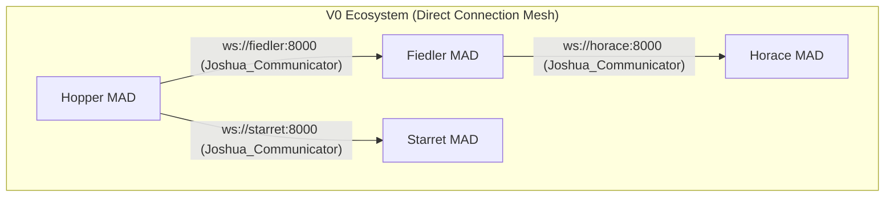
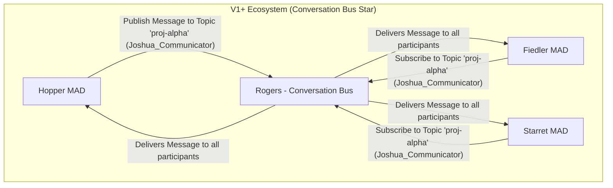

# Communication Architecture

**Version**: 1.0 (Unified)
**Status:** Authoritative

---

## 1. The Unified `Joshua_Communicator` Library

The single most important principle of the Joshua architecture is that **all MADs communicate through a single, unified library: `Joshua_Communicator`**. This library is a mandatory component for every MAD and provides a stable, version-agnostic API for all network I/O, logging, and ingress message routing.

### 1.1. Core Components

The `Joshua_Communicator` library is composed of three critical internal parts:
1.  **Network Transport:** The low-level component handling the physical sending and receiving of messages (e.g., WebSockets in V0, Kafka in V1+).
2.  **Communications Router:** A high-level, deterministic router that acts as the single entry point for all incoming messages, triaging them before they reach the MAD's core logic.
3.  **Integrated Logger:** A built-in logging interface that is tied to the active network transport (e.g., `stdout` for V0, Kafka for V1+).

## 2. The Internal Communications Router

The Communications Router is the heart of the MAD's ingress architecture. It is **not** part of the Thought Engine. It is a simple, fast, and deterministic router that lives inside the `Joshua_Communicator` library.

### 2.1. Routing Logic (Identical in V0 and V1+)

For every **external message** received by the Network Transport, the Communications Router applies the following rule:

**"Is this message a well-formed MCP tool call for a tool publicly exposed by the local Action Engine's MCP server?"**

*   **If YES (Fast Path):** The message is passed directly to the **Action Engine's MCP server** for execution. The Thought Engine is never engaged. This provides a highly efficient "fast path" for programmatic, deterministic tool calls (e.g., `horace_read_file`).
*   **If NO (Default Path):** The message is passed to the **Thought Engine's** default handler. This includes conversational prose, malformed MCP calls, or calls to non-existent tools, allowing for intelligent interpretation and error handling. When the Thought Engine needs to execute its own local Action Engine tools, it does so via a **direct, in-memory MCP call** to the Action Engine's dispatch function, bypassing this ingress router.

This architecture, defined in **ADR-021**, ensures clear separation of concerns and protocol consistency, and is the standard for all MADs, regardless of the V0 or V1+ transport layer.

## 3. Transport Layer Evolution: From Direct Mesh to Conversation Bus

The `Joshua_Communicator` library's facade pattern allows the underlying network topology to evolve significantly, from a tightly-coupled mesh to a loosely-coupled star topology, **without requiring changes to the MADs' core logic**.

### 3.1. V0 Transport: The Direct Connection Mesh

The V0 architecture is a **tightly-coupled mesh of direct connections** between MADs.

*   **Mechanism:** The `Joshua_Communicator` library uses a **WebSocket** transport. When a MAD (e.g., `Hopper`) wants to interact with another MAD (e.g., `Fiedler`), its `Communicator` establishes a direct, point-to-point WebSocket connection to `Fiedler`'s `Communicator`.
*   **Addressing:** The calling MAD must know the specific network address of the callee within the Docker network. Communication occurs via DNS service names and a standard internal port (e.g., `ws://fiedler:8000`).
*   **Characteristics:**
    *   **Tight Coupling:** The caller is tightly coupled to the callee's network location and availability.
    *   **Private Interactions:** Communications are private between the two participants and are not centrally observable by the rest of the ecosystem.
    *   **Simplicity:** This model prioritizes simplicity and direct interaction, suitable for the foundational phase.

### 3.2. V1+ Transport: The Conversation Bus Star Topology

The V1+ architecture introduces a **loosely-coupled star topology** centered on the **Rogers Conversation Bus**.

*   **Mechanism:** The `Joshua_Communicator` library's transport is seamlessly swapped to a **Kafka** implementation. When a MAD wants to interact, its `Communicator` publishes messages to logical Kafka topics on the bus, which is managed by the `Rogers` MAD.
*   **Addressing:** The calling MAD **does not know the network address** of the callee. It only interacts with `Rogers` and specifies a logical conversation ID or target MAD ID. `Rogers` then routes the message to the appropriate Kafka topic, and the recipient MAD consumes from that topic.
*   **Characteristics:**
    *   **Loose Coupling:** Caller and callee are decoupled. MADs can be added, removed, or scaled without affecting their clients.
    *   **Public and Observable:** All communication is a public, persistent record on the bus (archived by `Babbage`), making it fully observable for auditing, debugging, and learning.
    *   **Scalability & Resilience:** Kafka provides high throughput and message persistence, enabling greater resilience and scalability. Multiple instances of a MAD can subscribe to the same topic, distributing load.

### 3.3. Rogers: The Bus Controller and Service Registry

The **`Rogers` MAD** plays a central role in the V1+ Conversation Bus architecture as both the **Bus Controller** and **Service Registry** (per ADR-022).

*   **Bus Controller:** Manages the **control plane** of the Kafka bus (topic creation, configuration, lifecycle). `Rogers` is **not an active message router** in the data path; MADs publish and consume directly from Kafka topics.
*   **Service Registry:** Maintains an authoritative, centralized registry of all MADs' public tools and capabilities, making them discoverable via `rogers_find_tool` or `rogers_find_capability`.

### 3.4. `Babbage`: The Read Model Builder (CQRS Consumer)

The **`Babbage` MAD** is the primary consumer of the Kafka log, continuously building **CQRS Read Models** in MongoDB. This transforms the raw Kafka event stream into efficiently queryable documents for history, correlation, and long-term archival.

## 4. Key Decisions

*   **Unified `Joshua_Communicator` Library (ADR-021):** Provides a single, consistent interface for all MAD communication, abstracting away transport details and ensuring seamless migration.
*   **Direct Tool Exposure (ADR-023):** MADs expose their Action Engine tools directly, simplifying APIs and enhancing discoverability via the `Rogers` registry.
*   **Deterministic Ingress Router:** The `Communicator`'s internal router handles initial message triage, directing requests to the Action or Thought Engine based on message type, optimizing performance.
*   **Evolution to Conversation Bus:** The transition from V0's direct mesh to V1+'s Kafka-based bus enables radical decoupling, total observability, and persistent memory, crucial for a self-evolving system.

## 5. Constraints and Limitations

### V0 Specific Limitations

-   **Tight Network Coupling:** Caller MADs are coupled to the network location and availability of callee MADs.
-   **No Central Observability:** Interactions are private; difficult to analyze emergent, multi-MAD workflows.
-   **Manual Service Discovery:** MADs must know peer network addresses via configuration.
-   **Point-to-Point Complexity:** As MAD count grows, the mesh of direct connections becomes complex.

### V1+ Specific Limitations

-   **V1.0 Performance:** The Imperator-first approach results in higher latency (1-5 seconds) for non-trivial decisions. The system is not yet optimized for speed.
-   **Centralized Bus (Rogers):** `Rogers` is a single point of failure in V1.0. High availability and scaling strategies are future considerations.
-   **Manual Orchestration:** Deployment is managed via Docker Compose. Automated scaling and health management (e.g., via Kubernetes) are out of scope for V1.0.