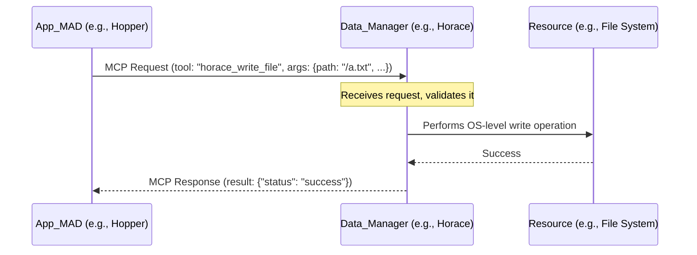
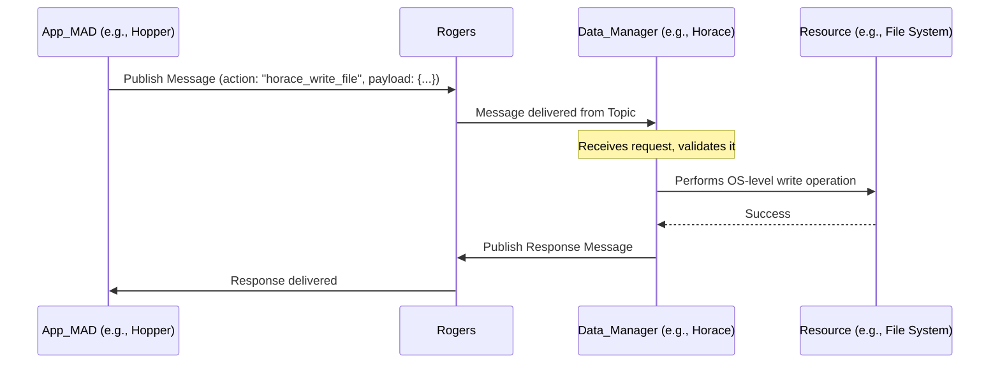

# Data Architecture

**Version**: 1.0 (Unified)
**Status:** Authoritative

---

## 1. The Resource-Manager Pattern

The Joshua data architecture is built on a single, consistent principle: the **Resource-Manager Pattern**. This is a core tenet of the Cellular Monolith philosophy.

-   **Resources:** The underlying data stores (PostgreSQL, MongoDB, NFS) are treated as passive resources (e.g., file systems, databases).
-   **Managers:** Specialist MADs (`Horace`, `Codd`, `Babbage`) are the active, intelligent managers for each resource. No other MAD is permitted to interact directly with a data store.

This pattern centralizes data governance, abstracts away the underlying storage technology, and ensures all data access is a managed, observable event.

### 1.1. The Primary Data Managers

The ecosystem relies on three primary data manager MADs:
-   **`Babbage`**: Manages semi-structured data (MongoDB). In V1+, its most critical role is archiving the entire conversation bus and building CQRS Read Models.
-   **`Codd`**: Manages structured, relational data (PostgreSQL).
-   **`Horace`**: Manages unstructured files and directories (on a shared file system like NFS).

> **Multi-Environment Note:** In multi-environment deployments (dev/test/prod), each environment has its own isolated data manager instances (e.g., `horace-dev`, `horace-test`, `horace-prod`) managing separate storage backends. See **ADR-025: Environment-Specific Storage** and **10_Docker_Network_Configuration.md** for details on environment isolation.

## 2. Evolution of Interaction with Data Managers

The Resource-Manager pattern itself remains constant from V0 to V1+. The key evolution is *how* other MADs interact with these managers, which mirrors the overall evolution of the communication architecture (from direct connections to the conversation bus).

### 2.1. V0 Interaction: Direct Tool Calls

In the V0 Direct Communication model, a MAD interacts with a data manager by making a direct, RPC-style tool call to its specific network endpoint.

*   **Mechanism:** A MAD uses its `Joshua_Communicator` to send a message to a specific network address (e.g., `ws://horace:8000`).
*   **Coupling:** This creates **tight network-level coupling**. The calling MAD must know the address of the data manager and is dependent on its direct availability.
*   **Centralized Logic:** The data manager MAD contains all the logic for interacting with the resource, including query optimization, schema management, and health checks.
*   **RPC Interface:** All data operations are direct tool calls to the data manager MAD.

### 2.2. V1+ Interaction: Conversation on the Bus

In the V1+ Conversation Bus model, a MAD interacts with a data manager by sending a message to a logical topic on the bus.

*   **Mechanism:** A MAD uses its `Joshua_Communicator` to publish a message (containing the desired action and payload) to a Kafka topic on the `Rogers` Conversation Bus. It **does not know the network address** of the specific data manager instance.
*   **Coupling:** This creates **loose coupling**. The calling MAD is completely decoupled from the data manager's physical location or direct availability.
*   **Conversational Interface:** All data operations are requests on the conversation bus, making data access fully audited and observable.
*   **`Babbage` as CQRS Read Model Builder:** `Babbage` plays a critical role in V1+ as the primary consumer of the Kafka log, continuously reading the complete event stream and building optimized CQRS Read Models in MongoDB for efficient historical querying and deep analysis.

## 3. Key Decisions & Consequences

-   **Data Managers over Direct Access:** This pattern is fundamental to the architecture. It enhances security, maintainability, and observability by treating all data access as a managed service call.
-   **Separation of Concerns:** Assigning each data type to a specialist MAD allows for optimized tooling and expertise (e.g., `Codd` for SQL, `Babbage` for MongoDB) without complicating the logic of other MADs.
-   **`Babbage` as System Memory:** In V1+, making the conversation archive the primary responsibility of `Babbage` establishes a strong foundation for the system's ability to learn and reflect on its own history through its CQRS Read Models.

## 4. Constraints and Limitations

### General Limitations
-   **Performance Overhead:** Every data operation, especially in V1+, incurs the latency of a round trip through the `Joshua_Communicator` and potentially the conversation bus. This architecture is not suitable for extremely high-frequency, low-latency data access patterns that bypass the Thought Engine entirely.
-   **Transactional Complexity:** Distributed transactions across different data managers (e.g., writing to `Codd` and `Horace` atomically) are not natively supported in V1.0 and would require complex conversational orchestration (e.g., Saga pattern) or explicit design.
-   **Data Consistency:** Consistency is managed at the level of the individual data manager. There are no system-wide consistency guarantees between `Codd`, `Babbage`, and `Horace` beyond what is explicitly orchestrated.

### V0 Specific Limitations
-   **Hard-Coded Dependencies:** The client MAD must explicitly know the network address (`ws://mad_name:8000`) of the data manager MAD it needs to contact.
-   **File I/O Evolution:** Early V0 MADs (V0.1-V0.6) used direct file system operations. However, the standard V0.7+ architecture requires all file system access to go through the **Horace** data manager MAD. In multi-environment deployments (ADR-025), Horace manages environment-specific storage (e.g., `/mnt/irina_storage/dev/files` for dev).

## 5. Future Considerations

-   **Data Federation:** A future MAD could act as a query federation layer, allowing a single request to retrieve and join data from `Codd`, `Babbage`, and `Horace` simultaneously.
-   **Caching:** A caching layer could be introduced (potentially as a new MAD) to improve read performance for frequently accessed data.
-   **Semantic Search:** `Babbage`'s capabilities will be enhanced in future versions to allow semantic searching of conversation history, rather than just keyword/metadata-based queries.