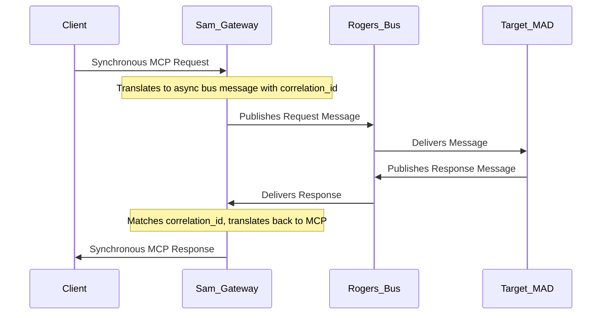

# Integration Architecture

**Version**: 1.0 (Unified)
**Status:** Authoritative

---

## 1. Overview

The Joshua integration architecture is designed with a highly secure and controlled boundary. The ecosystem is a closed system by default, with all external interactions managed by specialist MADs acting as gateways and security checkpoints. This ensures internal MADs operate with a simplified world model, interacting only via the `Joshua_Communicator` and the conversation bus, while external complexities are managed at the edge.

This document describes the evolution of these integration patterns, from the simple V0 `MCP Relay` to the sophisticated, specialized gateways of the V1+ architecture.

## 2. Architectural Evolution

### 2.1. V0 Integration: `Sam` (The MCP Gateway)

The V0 architecture uses a single, centralized **`Sam` (MCP Gateway)** for external programmatic access.

*   **Pattern:** `Sam` aggregates the tool APIs of multiple backend MADs. It connects directly to their `Joshua_Communicator` servers via WebSockets.
*   **Mechanism:** It exposes a single WebSocket endpoint to the external world (e.g., `host:9001`). When an external client sends a tool call (e.g., `horace_read_file`), the gateway forwards the request to the appropriate backend MAD.
*   **Limitations:**
    *   **Tight Coupling:** `Sam` is tightly coupled to the network addresses and tool names of individual MADs.
    *   **No Abstraction:** It primarily provides routing, with limited protocol translation or service abstraction.
    *   **Decentralized Security:** Authentication and authorization are handled by each backend MAD, making centralized security management difficult.

```mermaid
graph TD
    ExternalClient[External Client] -- "Single WebSocket Connection" --> Sam_Gateway[`Sam` (MCP Gateway)]
    subgraph "V0 Ecosystem"
        Sam_Gateway -- "Connects to ws://fiedler:8000" --> Fiedler[Fiedler MAD]
        Sam_Gateway -- "Connects to ws://horace:8000" --> Horace[Horace MAD]
        Sam_Gateway -- "Connects to ws://turing:8000" --> Turing[Turing MAD]
    end
```

### 2.2. V1+ Integration: Specialist Gateways

The V1+ architecture replaces the simple Relay with a set of specialized MADs, each managing a different type of external interaction via the Conversation Bus. This provides greater security, abstraction, and flexibility.

*   **`Sam` - The Programmatic Gateway:**
    *   **Role:** The **sole entry point for external programmatic clients** (e.g., CLIs like Claude Code, third-party services).
    *   **Mechanism:** `Sam` exposes an MCP server and acts as a sophisticated **synchronous-to-asynchronous bridge**. It accepts external MCP requests and translates them into asynchronous conversations on the internal Kafka-based bus, managing correlation IDs for responses. This abstracts the internal bus complexity from external clients.
    *   **Abstraction:** External clients are completely abstracted from the internal workings of the ecosystem and the specific MADs that fulfill their requests.

*   **`Grace` - The Human User Interface (UI):**
    *   **Role:** The primary entry point for **human users** to interact with Joshua via a web interface.
    *   **Mechanism:** `Grace` serves its web frontend. Its backend maintains a persistent `Joshua_Communicator` connection to the `Rogers` Conversation Bus, acting as a relay between the user's browser and the internal conversations.
    *   **Not a Gateway:** `Grace` itself is not a programmatic gateway; it is a web application that facilitates human interaction.

*   **`Cerf` - The Future API Gateway:**
    *   **Role:** Architected to evolve into a full-featured, active API Gateway for public REST/GraphQL APIs. (In early V1.0, Cerf is a passive network monitor).
    *   **Future Functionality:** Will handle routing, rate limiting, and enforce security policies at the edge for a broader range of protocols.

*   **Egress Gateways (Exit Points):**
    *   **`Malory`** (formerly `Polo`): Manages all interactions with the public web, acting as an autonomous, automated browser for web research and application interaction.

*   **Orchestration and Advisory Services:**
    *   **`Fiedler`**: AI Model Ecosystem Orchestrator - Maintains the Master Model Index (MMI), provides model recommendations, and coordinates GPU resource allocation. MADs access AI models directly via library nodes (`LLMCLINode` from joshua_core for universal access, or provider-specific nodes from joshua_gemini/, joshua_claude/, etc.), not through Fiedler execution calls. See ADR-035 and ADR-036.

## 3. Key V1+ Integration Patterns

### 3.1. Protocol Translation at the Edge

A core principle of the V1+ architecture is that translation from external protocols (e.g., MCP, HTTP) to the internal conversation protocol happens immediately at the gateway. The internal ecosystem only ever needs to speak one language: the asynchronous, event-driven language of the conversation bus.



### 3.2. Conversational Security

Security functions like authentication and authorization are not implemented as middleware within the gateways. Instead, they are services provided by a specialist MAD, `Bace`, via the standard patterns of the conversation bus. When a request arrives at `Sam` or `Grace`, the gateway MAD initiates a conversation with `Bace` to validate credentials and check permissions before proceeding. This centralizes all security policy in `Bace`.

### 3.3. External Service Access Patterns

**Unmediated** direct API access to services outside the Joshua ecosystem is an **architectural anti-pattern**. All external access must use approved patterns: either delegation to specialist gateway MADs or use of approved shared library nodes.

*   **For Web Access:** All HTTP requests, web scraping, or browser automation **must** be performed by calling the tools exposed by the **`Malory`** MAD.
*   **For AI Model Access (per ADR-035/ADR-036):** MADs **must** use library nodes for direct AI model access. Use `LLMCLINode` (from joshua_core) for universal, provider-agnostic access, or provider-specific nodes from joshua_gemini/, joshua_claude/, joshua_openai/ for vendor-specific features. These nodes are the approved pattern for LLM execution. MADs may query `Fiedler` for model recommendations or GPU resource coordination, but execution happens via the library nodes, not Fiedler tool calls.
*   **For Git Operations:** All interactions with Git repositories **must** be performed by calling the tools exposed by the **`Starret`** MAD.

This pattern is a core tenet of the architecture, ensuring that secrets are centralized, external access is auditable, and resilience patterns (like caching and retries) are managed consistently by domain experts.

## 5. Constraints and Limitations

### General Limitations
-   **Limited Protocols:** In early V1.0, support is limited to MCP (via `Sam`) and HTTP/WebSocket (via `Grace`). Other protocols are future considerations.
-   **Gateway as Potential Bottleneck:** As primary entry points, `Sam` and `Grace`'s performance and scalability are critical for the entire system.

### V0 Specific Limitations
-   **Security Complexity:** With every MAD potentially exposing an MCP server, securing the ecosystem requires configuring and managing security for each MAD individually.
-   **Service Discovery:** Clients (including the Relay) need to know the specific network address for every MAD they want to interact with (e.g., `ws://fiedler:8000`).

## 6. Future Considerations

-   **`Cerf` as an Active Gateway:** As `Cerf` matures, it will provide advanced routing, rate limiting, and schema validation for public APIs.
-   **Event-Driven Egress:** A future MAD could subscribe to internal bus events and push them to external systems (e.g., webhooks).
-   **Support for More Protocols:** The gateway pattern can be extended by creating new MADs for gRPC, GraphQL, or other protocols.