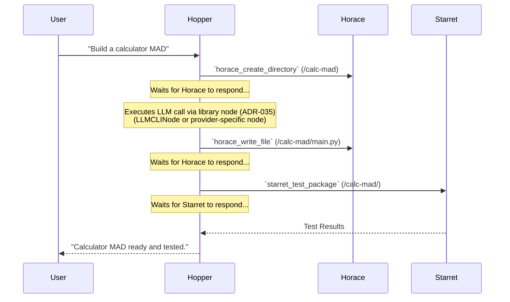
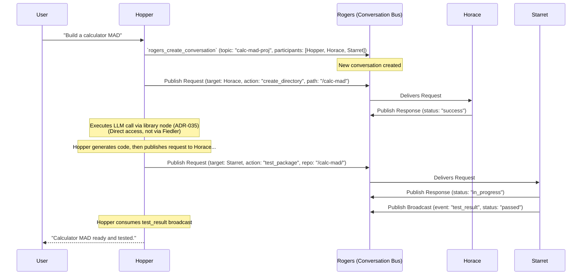

# Workflow Orchestration

**Version**: 1.0 (Unified)
**Status:** Authoritative

---

## 1. Core Principle: Decentralized Orchestration

Workflow orchestration in the Joshua ecosystem is **always decentralized and owned by each MAD within its domain.** There is no central workflow engine or orchestrator. This is a core tenet of the Cellular Monolith architecture, ensuring autonomy and resilience.

Each MAD is responsible for achieving goals related to its expertise. To do this, it executes a workflow, which can be either a pre-defined sequence of steps or a dynamic plan created in the moment.

## 2. Types of Workflows (Within a MAD)

Workflows executed within a MAD fall into two primary categories:

1.  **Programmatic Workflows:** These are explicitly coded, deterministic sequences of actions. They are used for common, repeatable tasks where the logic is well-defined and predictable. This is equivalent to a standard script or function within the MAD's Action Engine.
2.  **Emergent Workflows:** These are dynamically created plans devised by the MAD's Thought Engine (Imperator) in response to novel or complex tasks. The Thought Engine analyzes the goal, breaks it down into steps, determines which tools (internal or external) to call, and orchestrates their execution. These workflows adapt to real-time context and unexpected conditions.

## 3. Evolution of Inter-MAD Orchestration

The fundamental logic of workflows *within* a MAD (programmatic or emergent) remains consistent across versions. The key evolution is in **how these workflows interact with other MADs** when a capability outside the MAD's immediate domain is required.

### 3.1. V0: Tightly-Coupled Direct Calls

In the V0 Direct Communication model, when a MAD's workflow needs a capability from another MAD, it makes a direct, point-to-point tool call.

*   **Mechanism:** The orchestrating MAD uses its `Joshua_Communicator` to send an asynchronous message containing an MCP tool call directly to the target MAD's specific network address (e.g., `ws://fiedler:8000`).
*   **Interaction Model:** This involves **tightly-coupled request-response** interactions. Although asynchronous at the transport level, the workflow in the calling MAD typically awaits the direct response from the peer MAD before proceeding to the next step.
*   **Limitations:**
    *   **Brittle Orchestration:** Workflows are dependent on the direct availability and network location of peer MADs.
    *   **Limited Observability:** These interactions are private between two MADs and not centrally observable, making it difficult to analyze complex, multi-MAD workflows.
    *   **Point-to-Point Complexity:** As the number of MADs grows, the mesh of direct connections for orchestration becomes difficult to manage.

### 3.2. V1+: Loosely-Coupled Conversations (Mission Command)

In the V1+ Conversation Bus model, workflows interact with other MADs by publishing messages to shared, persistent topics on the `Rogers` Conversation Bus.

*   **Mechanism:** The orchestrating MAD's `Joshua_Communicator` publishes a message (containing an action, request, or broadcast) to a logical topic on the bus. It **does not know the network address** of the recipient MAD(s).
*   **Interaction Model:** This is a **loosely-coupled, event-driven** model. The orchestrating MAD publishes a message and can either `await` a response (using a `correlation_id` to match) or continue its own processing and react to the response whenever it arrives.
*   **Mission Command:** This model is complemented by the **Mission Command** doctrine, where `Joshua` sets high-level strategic objectives (the "what" and the "why"), and specialist MADs (`Hopper`, `Lovelace`, `Starret`, etc.) take tactical initiative, formulating their own plans (the "how"), and coordinating through conversations on the bus.
*   **Advantages:**
    *   **Resilience & Scalability:** Workflows are no longer dependent on direct peer availability. The bus ensures message delivery and allows for dynamic scaling of participants.
    *   **Total Observability:** All workflow steps become transparent, persistent conversations on the bus, enabling auditing, debugging, and continuous learning.
    *   **Emergent Coordination:** Complex, multi-participant workflows emerge naturally from MADs conversing about their work, sharing context, requesting assistance, and reporting status, without central control.

## 4. Example: Development Orchestration by `Hopper`

**`Hopper`** is the primary orchestrator for creating digital artifacts (code, documentation, etc.). Its workflow illustrates the transition from V0 direct calls to V1+ conversational coordination.

### 4.1. V0 `Hopper` Workflow (Direct Calls)

### 4.2. V1+ `Hopper` Workflow (Conversational)

## 5. Key Decisions and Constraints

### Key Decisions
-   **Decentralized Orchestration:** Each MAD retains autonomy over its domain, leading to a more resilient and adaptable system.
-   **Mission Command (V1+):** `Joshua` provides strategic intent, allowing MADs to take initiative and adapt their execution.
-   **Programmatic & Emergent Workflows:** Supporting both coded and LLM-devised workflows provides flexibility and power.
-   **Evolution to Conversation Bus (V1+):** Transitioning from direct calls to bus-based conversations fundamentally changes the nature of inter-MAD coordination, enabling greater decoupling and observability.

### Constraints and Limitations
-   **V0 Brittle Orchestration:** Workflows are tightly coupled to peer MAD availability and network addresses, making them less resilient.
-   **V1+ Coordination Complexity:** Conversation-based orchestration can be complex to debug, as the "workflow" is distributed across many asynchronous conversations.
-   **No eMADs in V1.0:** The vision for `Hopper` to spawn ephemeral MADs for parallel work (eMADs) is not implemented in V1.0; orchestration is primarily sequential.
-   **Potential for Deadlock:** In complex, multi-MAD workflows, especially in V0, there is a potential for circular dependencies or deadlocks that are not automatically detected or resolved.

## 6. Future Considerations

-   **Hopper's eMADs:** V1.1+ will implement the spawning of ephemeral MADs, transforming `Hopper` into a true parallel work orchestrator.
-   **LPPM for Learned Processes:** The Learned Prose-to-Process Mapper (LPPM) will be introduced in V1.1+, allowing MADs to learn and automate recurring multi-step workflows, making orchestration much more efficient.
-   **`Joshua`'s Arbitration:** `Joshua`'s role as an arbiter will be more fully implemented, allowing it to automatically detect and resolve resource conflicts or deadlocks between MADs via the conversation bus.