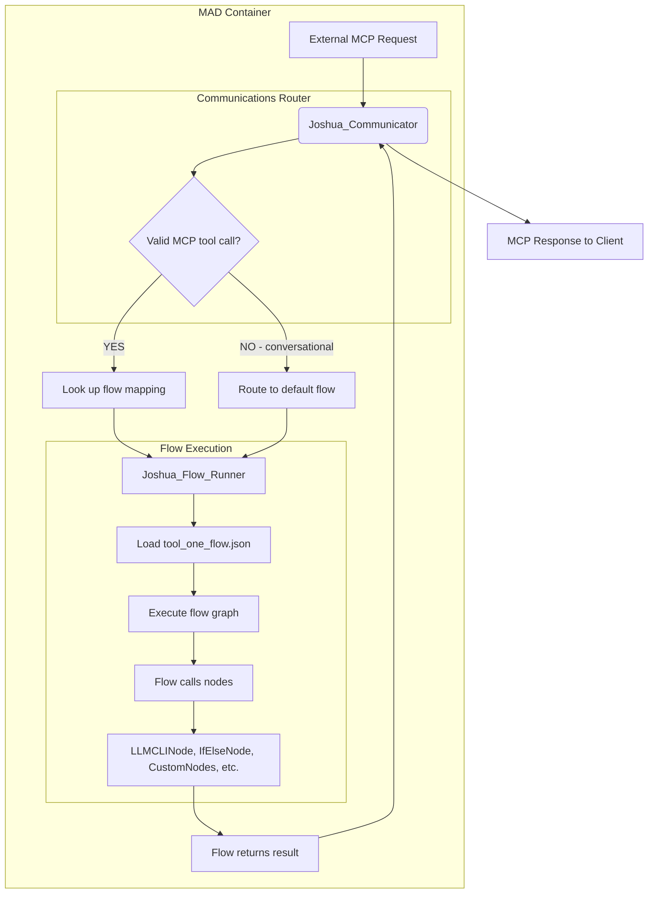

# 09_MAD_Internal_Architecture

**Version**: 2.0 (Flow-Based Architecture)
**Status**: Authoritative
**Related ADRs**: ADR-002, ADR-021, ADR-024, ADR-030, ADR-032, ADR-036
**Date**: 2025-12-21

---

## 1. Overview

This document provides the single source of truth for the internal architecture of a Multipurpose Agentic Duo (MAD) in the flow-based architecture era (V0.7+).

**Critical Principle (per ADR-032):** The MAD is a **thin composition layer**. The Action Engine and Thought Engine are **imported libraries**, not code within the MAD. The MAD contains only:
- Minimal wiring code (`server_joshua.py`)
- MAD-specific flows (`.json` files)
- Configuration files

This architecture is a cornerstone of the "Cellular Monolith" philosophy, ensuring every MAD shares common DNA while enabling specialized behavior through unique flows.

---

## 2. Core Components

Every MAD is composed of **imported libraries** that work in concert. The MAD itself is nearly empty - it declares dependencies and wires the libraries together.

### 2.1 The Action Engine (AE) - "The Hands"

**The AE is NOT a directory in the MAD - it is a set of imported libraries:**

- **`joshua_flow_runner`** - Headless Langflow execution engine
  - Loads and executes `.json` flow files
  - Provides the runtime for all MAD logic

- **`joshua_communicator`** - Network I/O and MCP server
  - Handles all network communication
  - Routes MCP tool calls to flows
  - Provides integrated logging

- **`joshua_flow_scheduler`** - Proactive flow execution
  - Triggers scheduled/periodic flows
  - Enables time-based autonomous behavior

**Characteristics:**
- **Imported, not implemented** - The MAD `requirements.txt` declares these dependencies
- **Shared across all MADs** - Same libraries used by all MADs
- **Zero MAD-specific code** - No custom AE implementation in the MAD

### 2.2 The Thought Engine (TE) - "The Brain"

**The TE is NOT a directory in the MAD - it is a set of imported libraries:**

- **`joshua_thought_engine`** - Master library (dependency aggregator)
  - Contains **NO implementation code**
  - Declares dependencies on PCP component libraries

- **PCP Component Libraries** - Provide custom nodes for flows:
  - `joshua_dtr` - Dynamic Triage Router nodes
  - `joshua_lppm` - Learning Prompt Pattern Manager nodes
  - `joshua_imperator` - Core Deliberative Reasoning nodes
  - `joshua_cet` - Cognitive Execution Tracker nodes
  - `joshua_crs` - Cognitive Reflection System nodes

**Characteristics:**
- **Imported, not implemented** - The MAD declares dependencies on these libraries
- **Provides nodes, not orchestration** - Libraries export nodes that flows can use
- **Flow-controlled** - Flows decide which cognitive components to use and when

### 2.3 Node Libraries - "The Toolbox"

**Node libraries provide reusable components that flows can use:**

- **`joshua_core`** - Universal nodes available to all MADs:
  - `LLMCLINode` - Provider-agnostic LLM access (per ADR-034)
  - Flow control nodes (if/else, loop, switch)
  - Utilities (string format, JSON parse, data transform)

- **Provider-specific libraries** (opt-in):
  - `joshua_gemini`, `joshua_claude`, `joshua_openai` - Vendor-specific features

- **Domain-specific libraries** (opt-in):
  - `joshua_ffmpeg`, `joshua_stable_diffusion`, `joshua_whisper` - Specialized compute

**Characteristics:**
- **Imported based on MAD needs** - MAD declares which node libraries it requires
- **Reusable across flows** - Same nodes used in multiple flows
- **Testable independently** - Node tests live in the library, not the MAD

---

## 3. MAD Physical Structure

### 3.1 Standard Directory Structure

**Per ADR-032**, the MAD repository is extremely minimal:

```
mad_name/
├── Dockerfile
├── docker-compose.yml
├── requirements.txt          # Declares ALL functionality via library dependencies
├── README.md
├── mad_name/                 # Python package root
│   ├── __init__.py
│   ├── server_joshua.py      # Minimal glue: imports libraries, wires them together
│   ├── flows/                # MAD-specific production flows (.json)
│   │   ├── main_flow.json
│   │   ├── planning_flow.json
│   │   └── tool_handler_flow.json
│   ├── test_flows/           # Test flows (executed by flow executor)
│   │   ├── test_main_flow.json
│   │   └── test_planning_flow.json
│   └── config/               # MAD-specific configuration
│       ├── persona.md        # MAD identity/personality
│       └── flow_config.yaml  # Flow parameters, model preferences
```

**What the MAD contains:**
- ✅ Minimal `server_joshua.py` (< 50 lines)
- ✅ MAD-specific flows (`.json` files)
- ✅ Configuration files
- ✅ Dependency declarations (`requirements.txt`)

**What the MAD does NOT contain:**
- ❌ Node implementations (in libraries)
- ❌ Flow execution engine (imported)
- ❌ Communication infrastructure (imported)
- ❌ Business logic (in flows, not code)

### 3.2 Example `server_joshua.py`

The MAD's entry point is extremely minimal - it imports libraries and wires them together:

```python
# server_joshua.py (Flow-Based Architecture - ADR-032)
import asyncio
import os
from pathlib import Path
from dotenv import load_dotenv

from joshua_communicator import Communicator
from joshua_flow_runner import FlowRunner

load_dotenv()
mad_name = os.getenv("MAD_NAME", "my_mad")

# Define MCP tools as flow triggers
# Each tool name maps to the flow file that handles it
TOOL_FLOW_MAPPINGS = {
    "my_mad_tool_one": "tool_one_flow.json",
    "my_mad_tool_two": "tool_two_flow.json",
}

async def main():
    # Paths to MAD-specific flows and config
    flows_dir = Path(__file__).parent / "flows"
    config_dir = Path(__file__).parent / "config"

    # Configuration for the Communicator (V0 WebSocket transport)
    config_v0 = {"version": "v0", "port": 8000}

    # Instantiate the Flow Runner (Action Engine)
    flow_runner = FlowRunner(
        mad_name=mad_name,
        flows_directory=flows_dir,
        config_directory=config_dir
    )
    await flow_runner.initialize()

    # Instantiate the Communicator (Action Engine)
    communicator = Communicator(
        mad_name=mad_name,
        tool_flow_mappings=TOOL_FLOW_MAPPINGS,
        flow_runner=flow_runner,
        config=config_v0
    )

    try:
        # Start the communicator (starts MCP server, routes tools to flows)
        await communicator.start()
        await communicator.log.info(f"{mad_name} is online on port {config_v0['port']}.")
        await asyncio.Event().wait()
    except Exception as e:
        await communicator.log.error(f"{mad_name} failed to start: {e}")
    finally:
        await communicator.stop()

if __name__ == "__main__":
    asyncio.run(main())
```

**Key Points:**
- **< 50 lines** - Extremely minimal
- **No business logic** - Just imports and wiring
- **MCP tools → flow mappings** - Tools are just triggers
- **Pure composition** - All capabilities from libraries

### 3.3 Example `requirements.txt`

The MAD declares all functionality via library dependencies:

```txt
# Action Engine Libraries (imported, not implemented in MAD)
joshua_flow_runner>=0.7.0
joshua_communicator>=0.7.0
joshua_flow_scheduler>=0.7.0

# Thought Engine Libraries (imported, not implemented in MAD)
joshua_thought_engine>=0.7.0  # Master library (dependency aggregator)

# Node Libraries (imported, available to flows)
joshua_core>=1.0.0            # Universal nodes (LLMCLINode, flow control, utilities)
joshua_gemini>=1.0.0          # Provider-specific (opt-in, if needed)
joshua_ffmpeg>=1.0.0          # Domain-specific (opt-in, if needed)
```

---

## 4. Data Flow & Routing

### 4.1 MCP Tool Calls → Flow Execution

**Per ADR-032**, MCP tools are **flow triggers**, not function calls:



**Flow:**
1. External client calls MCP tool (e.g., `my_mad_tool_one`)
2. `Joshua_Communicator` routes based on `TOOL_FLOW_MAPPINGS`
3. `Joshua_Flow_Runner` loads corresponding `.json` flow
4. Flow executes - calling nodes from imported libraries
5. Flow returns result
6. `Communicator` sends MCP response

**No Python tool functions** - Tools just map to flows. All logic is in the flows.

### 4.2 Flow-Based Logic

**Example flow (`tool_one_flow.json`):**

```json
{
  "name": "Tool One Handler Flow",
  "nodes": [
    {
      "id": "validate_input",
      "type": "IfElseNode",
      "condition": "{{input.param}} != null",
      "true_path": "process",
      "false_path": "error"
    },
    {
      "id": "process",
      "type": "LLMCLINode",
      "model": "claude-sonnet-4.5",
      "prompt": "Process this request: {{input.param}}",
      "next": "format_response"
    },
    {
      "id": "format_response",
      "type": "DataTransformNode",
      "transform": "format_json",
      "output": "result"
    },
    {
      "id": "error",
      "type": "ErrorNode",
      "message": "Invalid input parameter"
    }
  ]
}
```

**All logic is declarative** - No imperative Python code.

---

## 5. Testing Model

### 5.1 Node Testing

**Unit tests for nodes live in the node libraries**, not in the MAD:

```
joshua_core/
├── components/
│   └── llm_cli_node.py
└── tests/
    └── test_llm_cli_node.py  # Node tests HERE
```

Each node library has its own test suite.

### 5.2 Flow Testing

**Integration tests for flows live in the MAD's `test_flows/` directory:**

```
mad_name/
├── flows/
│   └── tool_one_flow.json       # Production flow
└── test_flows/
    └── test_tool_one_flow.json  # Test flow with assertions
```

**Test flow example:**

```json
{
  "name": "Test Tool One Flow",
  "nodes": [
    {
      "id": "run_flow",
      "type": "FlowExecutorNode",
      "flow": "tool_one_flow.json",
      "inputs": {"param": "test_value"},
      "next": "assert_result"
    },
    {
      "id": "assert_result",
      "type": "AssertNode",
      "condition": "{{run_flow.output.status}} == 'success'",
      "fail_message": "Flow did not return success"
    }
  ]
}
```

**Test execution** - Performed by flow executor (typically orchestrated by Deming MAD)

---

## 6. Polyglot Subprocess Pattern (ADR-024)

This pattern remains valid for MADs requiring non-Python components (e.g., Malory with Node.js/Playwright).

### 6.1 Integration with Flow-Based Architecture

The polyglot pattern adapts to flows by **wrapping subprocess calls in custom nodes**:

**Example: Malory's Playwright integration**

```
joshua_playwright/              # Custom node library (not in MAD)
├── components/
│   └── playwright_node.py      # Wraps Node.js subprocess
└── subprocess/
    └── playwright_script.js    # Actual Playwright code
```

**PlaywrightNode implementation:**

```python
# joshua_playwright/components/playwright_node.py
import subprocess
import json
from langflow import CustomComponent

class PlaywrightNode(CustomComponent):
    def build(self, url: str, action: str) -> dict:
        # Invoke Node.js subprocess
        result = subprocess.run(
            ['node', 'subprocess/playwright_script.js'],
            input=json.dumps({"url": url, "action": action}),
            capture_output=True,
            text=True
        )
        return json.loads(result.stdout)
```

**Malory's flow uses the custom node:**

```json
{
  "nodes": [
    {
      "id": "browse",
      "type": "PlaywrightNode",
      "url": "{{input.url}}",
      "action": "click_button"
    }
  ]
}
```

### 6.2 Three-Layer Pattern (Updated)

1. **Layer 1: Flow definition** - MAD's `.json` flow file
2. **Layer 2: Custom node wrapper** - Python node in library that invokes subprocess
3. **Layer 3: Non-Python subprocess** - Actual specialized implementation (Node.js, Rust, etc.)

**Key difference from old architecture:**
- **Old:** Tool function in MAD's `action_engine/` calls subprocess
- **New:** Custom node in **library** calls subprocess, flow uses the node

The MAD remains pure composition - it just declares dependency on `joshua_playwright` library.

---

## 7. Composition Pattern Summary

### 7.1 What Lives Where

| Component | Location | Example |
|-----------|----------|---------|
| Flow execution engine | `joshua_flow_runner` library | `FlowRunner` class |
| Network I/O | `joshua_communicator` library | `Communicator` class |
| Cognitive nodes | PCP libraries | `joshua_imperator`, `joshua_dtr` |
| Universal nodes | `joshua_core` library | `LLMCLINode`, `IfElseNode` |
| Custom nodes | Domain libraries | `joshua_playwright`, `joshua_ffmpeg` |
| MAD-specific flows | MAD `flows/` directory | `tool_one_flow.json` |
| MAD wiring code | MAD `server_joshua.py` | < 50 lines |
| Configuration | MAD `config/` directory | `persona.md`, `flow_config.yaml` |

### 7.2 Dependency Flow

```
MAD (thin container)
  imports→ joshua_flow_runner (executes flows)
  imports→ joshua_communicator (MCP server)
  imports→ joshua_thought_engine (dependency aggregator, NO CODE)
    imports→ joshua_dtr (nodes)
    imports→ joshua_imperator (nodes)
    imports→ joshua_lppm (nodes)
    imports→ joshua_cet (nodes)
    imports→ joshua_crs (nodes)
  imports→ joshua_core (universal nodes)
  imports→ joshua_gemini (opt-in provider nodes)
  imports→ joshua_ffmpeg (opt-in domain nodes)
```

**Result:** The MAD is almost empty. It declares dependencies, maps tools to flows, and wires libraries together. All capabilities come from libraries. All logic is in flows.

---

## 8. Evolution from Code-First to Flow-Based

### 8.1 Architectural Shift

**Before (V0.5 - Code-First):**
- MAD contained `action_engine/tools/` with Python functions
- MAD contained `thought_engine/` with ThoughtEngine config
- Logic written in imperative Python code
- MADs were 1000+ lines of custom code

**After (V0.7+ - Flow-Based per ADR-032):**
- MAD contains `flows/` with `.json` flow files
- MAD imports libraries (no internal engine directories)
- Logic defined declaratively in flow graphs
- MADs are < 100 lines of wiring code

### 8.2 Migration Path

Existing MADs will migrate logic from Python to flows:
1. High-value, stable logic migrates first
2. Critical performance paths may remain as optimized custom nodes (in libraries)
3. MAD becomes progressively thinner as logic moves to flows

---

## 9. Related Documentation

- **ADR-032**: Fully Flow-Based Architecture - **PRIMARY REFERENCE** for this document
- **ADR-021**: Unified I/O and Logging Hub - `Joshua_Communicator` architecture
- **ADR-024**: Polyglot Subprocess Pattern - Non-Python component integration
- **ADR-030**: Langflow Internal Architecture - Flow execution foundation
- **ADR-034**: CLI-First LLM Integration Strategy - How LLM access works
- **ADR-036**: Node Library Architecture - Node organization and acquisition
- **ADR-037**: LangFlow Node Sourcing Strategy - When to use native vs custom nodes

---

**Document Status**: Authoritative - Supersedes previous versions
**Supersedes**: Version 1.1 (code-first architecture)
**Last Updated**: 2025-12-21
