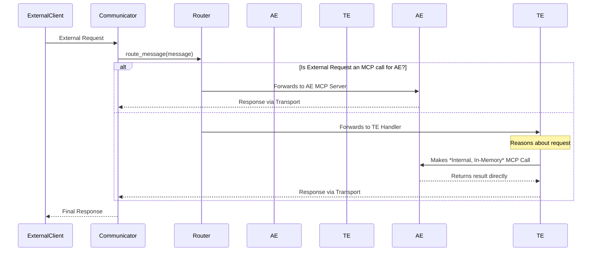

# `Joshua_Communicator` Library Design

- **Version**: 0.7
- **Status**: Design
- **Related Requirements**: `docs/requirements/20_Joshua_Communicator_Library_Specification.md`
- **Related ADRs**: ADR-021, ADR-023

---

## 1. Overview

This document provides the technical design for the `Joshua_Communicator` shared library. It details the class structure, internal components, and data flows required to meet the specification of a unified, version-agnostic communication library with integrated ingress routing.

---

## 2. Library Structure

The library will be located at `/mnt/projects/Joshua/lib/joshua_communicator/` and will follow a standard Python package structure.

```
joshua_communicator/
├── pyproject.toml                 # Package metadata and dependencies
├── README.md
├── joshua_communicator/
│   ├── __init__.py                # Exports the main Communicator class
│   ├── communicator.py            # The main Communicator facade class
│   ├── router.py                  # The CommunicationsRouter class
│   ├── logger.py                  # The integrated logging component
│   ├── transports/
│   │   ├── __init__.py
│   │   ├── base.py                # Abstract base class for transports
│   │   └── v0_websocket.py        # V0 WebSocket transport implementation
│   └── errors.py                  # Custom error classes (e.g., ToolError)
└── tests/
    ├── test_router.py
    └── test_v0_transport.py
```

---

## 3. Core Components

### 3.1 `Communicator` Class (The Facade)

This is the public-facing class that MADs will instantiate. It acts as a facade, orchestrating the router, transport, and logger.

**File:** `joshua_communicator/communicator.py`

```python
from .router import CommunicationsRouter
from .logger import IntegratedLogger
from .transports.base import BaseTransport
from .transports.v0_websocket import V0WebSocketTransport

class Communicator:
    """
    The unified facade for all MAD communication, routing, and logging.
    """
    def __init__(self, mad_name: str, action_engine_tools: dict, thought_engine_handler: callable, config: dict):
        """
        Initializes the Communicator, router, and the correct transport.
        """
        self.mad_name = mad_name
        self.log = IntegratedLogger(mad_name, config)
        self.router = CommunicationsRouter(
            action_engine_tools=action_engine_tools,
            thought_engine_handler=thought_engine_handler,
            logger=self.log
        )

        # Transport Factory
        if config.get("version") == "v0":
            self.transport: BaseTransport = V0WebSocketTransport(
                port=config.get("port"),
                message_handler=self.router.route_message
            )
        # elif config.get("version") == "v1":
        #     self.transport = V1KafkaTransport(...) # Future implementation
        else:
            raise ValueError("Invalid or missing 'version' in config")

    async def start(self):
        """Starts the underlying network transport listener."""
        await self.transport.start()

    async def stop(self):
        """Stops the underlying network transport."""
        await self.transport.stop()

    async def send_message(self, destination_url: str, message: dict) -> dict:
        """
        Sends a message to another MAD (for external communication only).
        Internal TE-to-AE calls are direct and in-memory.
        Note: The signature will adapt for V1 (destination will be a topic).
        """
        return await self.transport.send(destination_url, message)
```

### 3.2 `CommunicationsRouter` Class

This internal class contains the core ingress triage logic.

**File:** `joshua_communicator/router.py`

```python
import jsonrpc_py

class CommunicationsRouter:
    """
    Inspects incoming messages and routes them to the Action Engine (fast path)
    or the Thought Engine (default path).
    """
    def __init__(self, action_engine_tools: dict, thought_engine_handler: callable, logger):
        self.action_tools = action_engine_tools
        self.thought_engine_handler = thought_engine_handler
        self.log = logger

    async def route_message(self, message: dict) -> dict:
        """
        The main routing entry point for EXTERNAL messages, called by the transport.
        It does not handle internal TE-to-AE calls.
        """
        # 1. Check for well-formed JSON-RPC 2.0
        try:
            jsonrpc_py.parse(message)
            is_mcp_call = True
            method = message.get("method")
        except Exception:
            is_mcp_call = False
            method = None

        # 2. Check if the method is a known Action Engine tool
        if is_mcp_call and method in self.action_tools:
            # FAST PATH: Route to Action Engine
            await self.log.info(f"Routing MCP call for '{method}' to Action Engine.")
            handler = self.action_tools[method]
            # (Implementation will handle JSON-RPC parameter binding and response wrapping)
            # ... execute handler and return MCP response ...
            return await self._execute_action_tool(handler, message)
        else:
            # DEFAULT PATH: Route to Thought Engine
            await self.log.info("Routing non-MCP message to Thought Engine.")
            return await self.thought_engine_handler(message)

    async def _execute_action_tool(self, handler, request):
        # ... (implementation details for calling the tool) ...
        pass
```

### 3.3 `BaseTransport` and Implementations

This defines the interface for network transports.

**File:** `joshua_communicator/transports/base.py`

```python
from abc import ABC, abstractmethod

class BaseTransport(ABC):
    @abstractmethod
    async def start(self):
        """Start the transport's server/listener."""
        pass

    @abstractmethod
    async def stop(self):
        """Stop the transport's server/listener."""
        pass

    @abstractmethod
    async def send(self, destination: str, message: dict) -> dict:
        """Send a message and await a response."""
        pass
```

---

## 4. V0 WebSocket Transport Design

**File:** `joshua_communicator/transports/v0_websocket.py`

The `V0WebSocketTransport` will implement the `BaseTransport` interface using the `websockets` library.

-   **`start()`**: Will create and run a `websockets.serve()` server on the configured port. The main connection handler for this server will be a simple async function that receives a message, passes it to the `self.message_handler` (which is the `CommunicationsRouter.route_message` method), and sends the returned response back to the client.
-   **`send()`**: Will use `websockets.connect()` to open a client connection to the `destination_url`, send the `message`, await the response, and then close the connection.

---

## 5. Ingress Routing Flow

This sequence diagram illustrates the triage logic of the Communications Router.



## 6. Dependencies

-   `jsonrpc-py`: For robust parsing of JSON-RPC 2.0 messages.
-   `websockets`: For the V0 transport layer.
-   `python-dotenv`: For managing configuration.

A `pyproject.toml` file will be created to manage these dependencies for the shared library.
