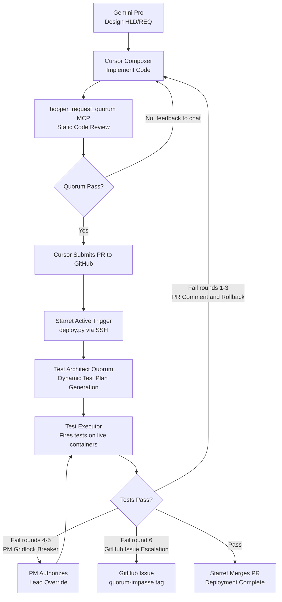

# High-Level Design: CI/CD Architecture

**Version:** 4.0
**Date:** 2026-03-09
**Status:** Active — Alexandria and Starret deployed 2026-03-09
**Related Documents:** HLD-software-factory-core.md, HLD-unified-package-caching.md, mads/starret/docs/REQ-starret.md, REQ-021-REQ-023-github-self-hosted-runner.md, mads/alexandria/docs/REQ-alexandria.md (supersedes REQ-018, REQ-019, REQ-022)

---

## Executive Summary

The CI/CD Architecture enables automated, safe deployments of the Joshua ecosystem across the Joshua lab. By combining GitHub Actions with self-hosted runners, local package caching (Alexandria: alexandria-devpi, alexandria-verdaccio), and script-based deployment (`deploy.py`), we achieve:

- **Fast builds**: Local package caches eliminate internet dependency
- **Safe deployments**: Starret enforces git guardrails for agents
- **Simple operations**: Single command deploys entire stack
- **Audit trail**: Track what's deployed where and when

**Key Capabilities:**
- Agents commit code safely via Starret MCP tools
- Starret actively triggers deployment workflow on PR merge
- Runner builds with local caches (sub-minute builds)
- Images pushed to local registry (alexandria-registry, irina:5000)
- `deploy.py` deploys to correct hosts via SSH + docker compose

**Architectural Principles:**
- **Facade Pattern**: All pMADs use composition (facade + backing containers)
- **MCP-Only Communication**: No REST APIs, all inter-actor communication via MCP
- **Active Triggers**: Starret initiates workflows, not passive webhooks
- **Architecture-Agnostic**: CI/CD works identically for State 0 (monolithic) and State 1 (facade/composition)

---

## Deployment Trigger Model

### Normal Path: Push to Main

The standard deployment path is **passive**: push to `main` fires the runner via `on: push: branches: [main]` automatically. The agent (Cursor directly, or Hopper's `software_engineer` via `starret_chat`) pushes code and the pipeline fires without any additional tool call. The self-hosted runner polls GitHub outbound continuously — no webhooks, no firewall holes.

### Ad-Hoc Path: workflow_dispatch

The Starret Imperator calls `workflow_dispatch` only when:
- Rolling back to a specific prior version without a new commit
- Re-running a deploy that failed mid-flight
- Triggering a deploy of a specific ref/branch outside the normal push flow

This is not the normal deploy path. It is the escape hatch.

### Prior Design Note

An earlier design used `workflow_dispatch` for all deploys (the 'Active Trigger' model) to give agents a `workflow_run_id` to monitor. This was superseded: `on: push` is simpler and sufficient for the normal case. The Starret Imperator can monitor deployment status via `starret_github` and direct health checks via the peer proxy if needed.

---

## Problem Statement

### Current Development Model

Agents and developers work directly on shared filesystems with manual deployment:

```
Agent → Edit files on /storage/projects → docker compose up --build
```

**Challenges:**
1. **No version control integration**: Changes happen outside Git workflow
2. **SSH confusion**: Deploying to remote hosts confuses LLMs
3. **No CI validation**: Code goes straight to production without checks
4. **Manual coordination**: Multi-host deployments require SSH to each machine
5. **No audit trail**: Can't easily answer "what version is running?"
6. **Actor discovery gaps**: No dynamic tool discovery across the ecosystem
7. **Fragile deployment**: docker-compose.yml + docker-compose.{host}.yml with profile filtering
8. **Registry misalignment**: Wrong container versions deployed due to manual process
9. **Inconsistent**: Each host requires separate deployment commands

### The Deployment Model

We use Docker Swarm for **overlay networking only** (`joshua-net` spans hosts). Deployment itself is **script-based CD**: `deploy.py` SSHes to each host and runs `docker compose` per host. This is the end state, not a transitional step.

- Swarm provides overlay networking (`joshua-net` spans hosts)
- `deploy.py` deploys to each host via SSH + docker compose
- No `docker stack deploy`; no Swarm orchestration lifecycle

---

## Solution Overview

### The "Hybrid-Local" Pipeline

**Cloud Layer (Control Plane):**
- GitHub stores source code (backup, history, PRs)
- GitHub Actions orchestrates workflow (executes on triggers)

**Lab Layer (Data Plane):**
- Self-hosted runner (Starret backing container) executes builds locally
- `alexandria-devpi` serves PyPI packages (Devpi, irina:3141)
- `alexandria-verdaccio` serves NPM packages (Verdaccio, irina:4873)
- Image registry (`alexandria-registry`) stores built containers (irina:5000)
- Actor discovery via pMAD gateway peer proxies
- `deploy.py` deploys to correct hosts via SSH + docker compose per host

**Key Principle:** Brains (GitHub) live in cloud, Muscle (builds/cache) lives in lab.

---

## Architecture Overview

```
┌─────────────────────────────────────────────────────────────────────────┐
│                            GITHUB.COM                                    │
│  ┌─────────────┐    ┌─────────────┐    ┌─────────────┐                 │
│  │   Repos     │    │   Actions   │    │     PRs     │                 │
│  │  (Joshua26) │    │ (Workflows) │    │   (Issues)  │                 │
│  └──────┬──────┘    └──────┬──────┘    └─────────────┘                 │
└─────────┼──────────────────┼────────────────────────────────────────────┘
          │                  │
          │ git push         │ workflow_dispatch (API call)
          │                  ▲
┌─────────┼──────────────────┼────────────────────────────────────────────┐
│         │              JOSHUA LAB                                        │
│         │                  │                                             │
│         ▼                  │                                             │
│  ┌─────────────┐           │ Triggers via GitHub API                    │
│  │  Starret    │───────────┘                                            │
│  │  (Git MCP)  │                                                         │
│  │             │        ┌───────────────────────────────────────┐       │
│  │ git_merge_pr├───────▶│   Self-Hosted GitHub Runner           │       │
│  │  triggers   │        │   (on Swarm Manager - Irina)          │       │
│  │  deploy     │        │                                        │       │
│  └─────────────┘        │  1. git pull from GitHub              │       │
│                         │  2. docker build (with local caches)  │       │
│                         │  3. docker push to irina:5000          │       │
│                         │  4. deploy.py (ssh -> docker compose) │       │
│                         │  5. MCP calls to ecosystem services     │       │
│                         └───────────────────────────────────────┘       │
│                                          │                               │
│         ┌────────────────────────────────┼──────────────────────┐       │
│         │                                │                      │       │
│         ▼                                ▼                      ▼       │
│  ┌─────────────┐              ┌─────────────┐         ┌─────────────┐  │
│  │             │              │ irina:5000  │         │ Alexandria  │  │
│  │  (Actor     │              │   (Image    │         │ (External   │  │
│  │  Registry)  │              │  Registry)  │         │ Dependency  │  │
│  │             │              │             │         │   Cache)    │  │
│  │ - Actors    │              │ - Images    │         │             │  │
│  │ - Components│              │ - Tags      │         │ 5 Components│  │
│  │ - Inventory │              │ - Versions  │         │ (hf, pypi,  │  │
│  │             │              │             │         │ npm, docker,│  │
│  │             │              │             │         │     apt)    │  │
│  └──────┬──────┘              └─────────────┘         └─────────────┘  │
│         │                             │                                 │
│         │                             │ deploy.py pulls images          │
│         │                             │ from registry via SSH           │
│         ▼                             ▼                                 │
│  ┌──────────────┬──────────────┐                                        │
│  │ alex-devpi   │ alex-vrdaccio│                                        │
│  │  (PyPI)      │    (NPM)     │                                        │
│  │   Devpi      │  Verdaccio   │                                        │
│  └──────────────┴──────────────┘                                        │
│                   │                                                      │
│                   ▼                                                      │
│  ┌─────────────────────────────────────────────────────────────────┐   │
│  │                      DOCKER SWARM                                │   │
│  │                                                                  │   │
│  │  ┌────────────────────┐           ┌────────────────────┐        │   │
│  │  │      IRINA         │           │         M5         │        │   │
│  │  │  (Swarm Manager)   │           │   (Swarm Worker)   │        │   │
│  │  │                    │           │                    │        │   │
│  │  │ FACADE PATTERN:    │           │ FACADE PATTERN:    │        │   │
│  │  │ ┌────────┬───────┐ │           │ ┌────────┬───────┐ │        │   │
│  │  │ │codd    │codd-db│ │           │ │rogers  │rogers-│ │        │   │
│  │  │ │(facade)│(pg)   │ │           │ │(facade)│db     │ │        │   │
│  │  │ └────────┴───────┘ │           │ └────────┴───────┘ │        │   │
│  │  │ ┌────────┬───────┐ │           │ ┌────────┬───────┐ │        │   │
│  │  │ │alexdria│alex-  │ │           │ │suthrlnd│(GPU)  │ │        │   │
│  │  │ │(facade)│pypi   │ │           │ │(facade)│       │ │        │   │
│  │  │ │        │alex-  │ │           │ └────────┴───────┘ │        │   │
│  │  │ │        │npm    │ │           │                    │        │   │
│  │  │ │        │alex-  │ │           │                    │        │   │
│  │  │ │        │docker │ │           │                    │        │   │
│  │  │ │        │alex-  │ │           │                    │        │   │
│  │  │ │        │apt    │ │           │                    │        │   │
│  │  │ └────────┴───────┘ │           │                    │        │   │
│  │  └────────────────────┘           └────────────────────┘        │   │
│  │                                                                  │   │
│  │           joshua-net (overlay network spans both)               │   │
│  └─────────────────────────────────────────────────────────────────┘   │
└─────────────────────────────────────────────────────────────────────────┘
```

---

## The Facade Pattern

**All pMADs use the Facade/Composition architecture:**

```
┌─────────────────────────────────────────┐
│         Logical Actor: "Codd"           │
│                                         │
│  ┌─────────────┐     ┌───────────────┐ │
│  │    codd     │────▶│   codd-db     │ │
│  │  (Facade)   │     │ (PostgreSQL)  │ │
│  │             │     │               │ │
│  │ - MCP Server│     │ - Data Store  │ │
│  │ - API Wrap  │     │ - Backing Svc │ │
│  │ - Action Eng│     │               │ │
│  └─────────────┘     └───────────────┘ │
│                                         │
└─────────────────────────────────────────┘
```

**Examples:**
- **codd**: Facade (MCP + API) → codd-db (PostgreSQL 16)
- **alexandria**: Facade (nginx MCP gateway) → 4 backing containers (alexandria-langgraph, alexandria-devpi, alexandria-verdaccio, alexandria-registry). Deployed 2026-03-09. Cache ports host-bound directly from backing containers; nginx is MCP-only.
- **rogers**: Facade (MCP + tools) → rogers-db (Redis)
- **sutherland**: Facade (MCP + GPUStack API) → sutherland-gpustack (GPUStack)

**Full Composition Model:**
All pMADs follow:
- **MCP gateway**: nginx or equivalent (e.g., `alexandria`)
- **LangGraph container**: Flow execution (e.g., `alexandria-langgraph`)
- **Backing containers**: Infrastructure services using official images (e.g., `alexandria-devpi`, `alexandria-registry`)

Labels track composition:
```yaml
labels:
  - "mad.logical_actor=alexandria"
  - "mad.component=mcp"  # or "langgraph", "devpi", "verdaccio", "registry", etc.
```

**Architecture-Agnostic CI/CD:**
The build and deployment process works identically for:
- **State 0**: Monolithic (1 container)
- **State 1**: Facade/composition (N containers)

The number of containers is irrelevant to CI/CD - `docker compose build` and `docker compose push` work the same way.

---

## Component Design

### 1. Starret (Release Department — Imperator-Based)

**Architecture:** Two containers (starret MCP Gateway + starret-langgraph Python Imperator) plus the github-runner backing container. Stateless — no database. Follows the same pattern as the Hopper Imperator.

**External MCP Surface (two tools only):**

| Tool | Purpose |
|------|---------|
| `starret_chat` | Natural language git operations. The Starret Imperator reasons about git state, enforces branch rules, and executes commit/push/branch/PR/merge. |
| `starret_github` | Structured GitHub API calls. Parameterized by `action` enum — covers all reads (get issue, PR status, PR comments) and writes (create issue, post comment, write metadata). |

**Deployment trigger:** Push to `main` fires the runner automatically via `on: push: branches: [main]`. No explicit `workflow_dispatch` call required for normal deploys. The Imperator calls `workflow_dispatch` only for ad-hoc deploys and rollbacks.

**Example interactions:**
```
# Hopper software_engineer calls starret_chat
{ "message": "commit and push my hopper changes" }
→ Imperator: assesses git status, commits relevant files, pushes
→ runner picks up on: push trigger → deploy.py → done

# Hopper software_engineer calls starret_github (read)
{ "action": "get_issue", "params": { "repo": "Joshua26", "issue_number": 212 } }
→ returns issue body, labels, comments — no Imperator involved

# Hopper software_engineer calls starret_github (write)
{ "action": "create_issue", "params": { "title": "quorum-impasse: ...", "labels": ["quorum-impasse"] } }
→ creates GitHub issue — no Imperator involved
```

**See:** `mads/starret/docs/REQ-starret.md`
**See:** REQ-020-starret-git-cicd-upgrade.md

---

### 3. Docker Image Registry (alexandria-registry)

> **Deployed 2026-03-09.** The Docker Registry 2.0 is deployed as `alexandria-registry`, a backing container within the Alexandria pMAD. It is not a separate pMAD. REQ-022-nineveh-docker-registry.md was a design proposal superseded by `mads/alexandria/docs/REQ-alexandria.md`.

**Purpose:** Store built container images for distribution across hosts

**Identity (Alexandria pMAD — all containers share):**
- UID: 2017
- GID: 2001 (administrators)
- Host: Irina
- Port: 5000 (host-bound directly from `alexandria-registry` container)

**Technology:** Docker Registry 2.0 (official `registry:2` image)

**Workflow Integration:**
```bash
# CI runner workflow
docker build -t codd:latest ./mads/codd
docker tag codd:latest irina:5000/codd:${VERSION}
docker push irina:5000/codd:${VERSION}

# deploy.py pulls from irina:5000 on target hosts
python3 scripts/deployment/deploy.py --all
```

**See:** `mads/alexandria/docs/REQ-alexandria.md`

---

### 4. PyPI Caching Proxy (alexandria-devpi)

> **Deployed 2026-03-09.** Consolidated into Alexandria pMAD. Container is `alexandria-devpi`. REQ-018-delphi-pypi-mirror.md was a design proposal superseded by `mads/alexandria/docs/REQ-alexandria.md`.

**Purpose:** Transparent caching proxy for PyPI packages

**Identity (Alexandria pMAD — all containers share):**
- UID: 2017
- GID: 2001 (administrators)
- Host: Irina
- Port: 3141 (host-bound directly from `alexandria-devpi` container)

**Technology:** Devpi (PyPI caching server)

**Client Configuration:**
`PIP_INDEX_URL=http://irina:3141/root/pypi/+simple/` and `PIP_TRUSTED_HOST=irina` (set in base images and docker daemon on all hosts)

**MCP tools** (served via `alexandria-langgraph`, not a separate container): `alex_warm_pypi`, `alex_list_packages`, `alex_cache_status`

**See:** `mads/alexandria/docs/REQ-alexandria.md` for the deployed implementation.

---

### 5. NPM Caching Proxy (alexandria-verdaccio)

> **Deployed 2026-03-09.** Consolidated into Alexandria pMAD. Container is `alexandria-verdaccio`. REQ-019-pergamum-npm-mirror.md was a design proposal superseded by `mads/alexandria/docs/REQ-alexandria.md`.

**Purpose:** Transparent caching proxy for NPM packages

**Identity (Alexandria pMAD — all containers share):**
- UID: 2017
- GID: 2001 (administrators)
- Host: Irina
- Port: 4873 (host-bound directly from `alexandria-verdaccio` container)

**Technology:** Verdaccio (NPM registry proxy)

**Client Configuration:**
`NPM_CONFIG_REGISTRY=http://irina:4873` (set in base images)

**MCP tools** (served via `alexandria-langgraph`, not a separate container): `alex_warm_npm`, `alex_list_packages`, `alex_cache_status`

**See:** `mads/alexandria/docs/REQ-alexandria.md` for the deployed implementation.

**Verdaccio Configuration:** Template at `mads/alexandria/config-templates/verdaccio/config.yaml`. Deployed to `/workspace/alexandria/config/verdaccio/config.yaml` on irina (not in repository). Key settings: storage at `/storage/packages/npm`, upstream proxy to `registry.npmjs.org`, all packages open access (`$all`). See `mads/alexandria/docs/REQ-alexandria.md`.

---

### 6. Self-Hosted GitHub Runner

**Deployment:** Container on Irina (Swarm manager), as a **backing container in the Starret pMAD group** (not a pMAD).

**Why Irina:**
- Has access to Alexandria caching proxies (alexandria-devpi :3141, alexandria-verdaccio :4873, alexandria-registry :5000)
- Has LAN reachability to all hosts targeted by script-based CD (SSH)
- Has local filesystem for builds

**Bare metal installations are forbidden.** The runner must be containerized.

**Trigger Mechanism:**

The runner does NOT use webhooks (private network). Instead:

1. **Starret's `git_merge_pr` tool** calls GitHub API after successful merge
2. GitHub API call: `POST /repos/{owner}/{repo}/actions/workflows/deploy.yml/dispatches`
3. This creates a `workflow_dispatch` event
4. Self-hosted runner picks up the job
5. Runner executes deployment workflow

**Configuration:** Full service definition in `docker-compose.irina.yml` under the Starret pMAD group. Key volumes: Docker socket (local builds), `/mnt/storage` (repo + deploy scripts), SSH keys at `/home/runner/.ssh:ro` (for `deploy.py`). Network: `starret-net` only. Key env: `PIP_INDEX_URL` and `NPM_CONFIG_REGISTRY` pointed at Alexandria. See REQ-023-github-self-hosted-runner.md.

---

## Workflows

### Workflow 1: Agent Development Flow

```
1. Agent receives task from user
   │
2. Agent calls starret.git_create_branch(branch="fix-bug-123")
   │
3. Agent edits files on /storage/projects/Joshua26
   │
4. Agent calls starret.git_commit(message="Fix bug in X")
   │
5. Agent calls starret.git_push()
   │
6. Agent calls starret.git_create_pr(title="Fix bug", base="main")
   │
7. PR created on GitHub, CI validation runs
   │
8. Agent monitors: starret.git_get_pr_status(pr_number=123)
   │
9. When CI passes, agent calls: starret.git_merge_pr(pr_number=123)
   │
   ├─▶ Merge succeeds
   │
   └─▶ starret.git_merge_pr internally triggers deployment:
       │
       └─▶ GitHub API call: workflow_dispatch(workflow="deploy.yml")
           │
           â–¼
       Self-hosted runner picks up job
```

### Workflow 2: CI/CD Pipeline (Triggered by Starret)

Workflow file: `.github/workflows/deploy.yml`. Triggers: `on: push` to `main` (normal deploy path) and `workflow_dispatch` (rollback / ad-hoc only).

**Steps:**
1. Checkout code
2. Set `VERSION` from short git SHA
3. Build all `mads/*/` images with `docker build`
4. Tag each image as `irina:5000/<actor>:<VERSION>` and `irina:5000/<actor>:latest`
5. Push all images to `irina:5000` (alexandria-registry)
6. Run `python3 scripts/deployment/deploy.py --all` (SSH to each host, runs `docker compose up`)

---

## Stack File Structure (Facade Pattern)

The master compose file (`docker-compose.yml` at project root) defines all services. Per-host override files (`docker-compose.irina.yml`, `docker-compose.m5.yml`) apply host affinity. Each service carries `mad.logical_actor` and `mad.component` labels for composition tracking.

Services by host:

| Host | Services |
|------|----------|
| irina | `codd`, `codd-db`, `alexandria` (+ 4 backing containers), `starret`, `starret-langgraph`, `github-runner` |
| m5 | `rogers`, `rogers-db`, `sutherland` |

See `docker-compose.yml` and per-host override files for full service definitions.
See REQ-000 §7.5 for Docker Compose configuration requirements.
---

## Performance Characteristics

### Build Times

| Scenario | Without Caches | With Local Caches |
|----------|----------------|-------------------|
| Python facade (50 packages) | 5-8 minutes | 30-45 seconds |
| Node facade (200 packages) | 3-5 minutes | 20-30 seconds |
| Full stack rebuild (15 actors × 2 components) | 60-90 minutes | 5-10 minutes |

### Deployment Times

| Operation | Time |
|-----------|------|
| Push images to registry (irina:5000) | ~30 seconds (LAN speed) |
| Script-based deploy (`deploy.py` via SSH) | ~60 seconds |
| Actor startup (healthy) | ~30 seconds per actor |
| **Total deployment** | **~3-5 minutes** |

---

## Security Considerations

### GitHub Token Scopes

Runner needs minimal permissions:
- `repo` - read/write code
- `actions` - trigger workflows

**Do not grant:**
- `admin:org`
- `delete_repo`

### MCP-Only Communication

All inter-actor communication uses MCP protocol:
- No HTTP REST APIs exposed
- No authentication needed on internal network (joshua-net)
- pMAD gateways are the sole network boundary on joshua-net

### Git Safety (Starret)

Starret enforces:
- No commits to `main` directly
- No committing secrets (.env, credentials.json)
- PR required for merges
- Branch protection rules

---

## Failure Modes

| Failure | Impact | Mitigation |
|---------|--------|------------|
| GitHub down | No new deployments | Local development continues |
| Runner crashes | Deployments fail | Compose restart policy restarts runner; manual fallback |
| alexandria-registry down | Can't deploy new versions | Running actors unaffected |
| alexandria-devpi down | Slow builds | Falls back to PyPI.org |
| alexandria-verdaccio down | Slow builds | Falls back to npmjs.org |
| Swarm overlay (joshua-net) down | Cross-host MCP calls fail | Restart Docker Swarm on Irina |

---

## The Agentic SDLC Loop

*This section captures the full end-to-end agentic software development lifecycle built on top of the CI/CD pipeline.*

Joshua26 is a fully agentic environment — no human writes code. The CI/CD pipeline must therefore serve agents as the primary actors, not humans. This section defines the complete loop from design to running production code.

### The Four Phases



**Phase 1 — Local Dev (Cursor + Static Quorum):**
Gemini Pro produces the HLD and REQ. Cursor (Composer) implements the code. Before committing, Cursor calls Hopper’s `hopper_request_quorum` MCP tool with `task="static_code_review"`. Hopper seeds a dedicated Rogers conversation for the Quorum run (HLD + REQ-000 + `config.json` + git diff). Reviewers and the Lead are prompted using `conv_retrieve_context`, so Rogers performs all context-window packing, RAG, and precedent retrieval behind the scenes. Composer fixes and re-requests until the Quorum returns APPROVED. Cursor then commits, pushes, and opens a PR.

**Phase 2 — Build and Deploy (Infrastructure):**
Starret's Active Trigger fires `workflow_dispatch`. The self-hosted runner on Irina builds the image using Alexandria caches (irina:3141, irina:4873) (<30 seconds). The new container is deployed to the live Swarm. No blue-green, no ephemeral environments — because there is no SLA, taking down a subsystem is safe.

**Phase 3 — Dynamic QA (Test Architect Quorum + Executor):**
The Test Architect Quorum reads the PR diff and formulates `ephemeral-test-plan.json`. The Test Executor rigidly fires every step in that plan against the live containers on `joshua-net`, delegating to Mallory for UI tests and querying databases directly for state verification.

**Phase 4 — Feedback Loop:**
On Pass, Starret merges the PR. On Fail, the Executor's logs are posted as a PR review comment, the Swarm service is rolled back to the prior image hash, and the loop restarts from Phase 1.

### Why Testing in Production is Joshua26's Superpower

Enterprise CI/CD deploys to ephemeral sandbox environments for testing because production has real users. Joshua26 has no real users and no SLA. This means:

- Tests run against real services (real LLMs, real Postgres, real Redis) — not mocks.
- A test that passes is a genuine proof of correctness, not a proof that the mock behaved correctly.
- Rollback is fast: check out a prior commit, re-run `deploy.py`, and the previous image version is running.
- There is no infrastructure overhead of maintaining a parallel testing environment.

---

## The Unified Quorum Engine

*The Unified Quorum Engine design is part of the Hopper eMAD.*

The Unified Quorum Engine is a single orchestration workflow built into **Hopper** that serves both the **Static Code Review** phase (pre-commit) and the **Dynamic Test Planning** phase (post-deploy). Building this as an engineering-domain capability (Hopper eMAD), rather than embedding it in the release-domain pMAD (Starret), preserves strict domain boundaries.

### Why a Single Engine for Both Uses

Both phases share the same fundamental pattern: a reasoning-heavy Lead model produces a draft output, independent reviewers critique it in parallel without seeing each other, a PM layer filters out-of-scope feedback, and the Lead synthesizes a final output. Only the input and the output differ.

| Use | Input | Output |
|-----|-------|--------|
| Static Code Review | Git diff + HLD | List of change requests / APPROVED |
| Dynamic Test Planning | Git diff + deployed code | `ephemeral-test-plan.json` |

### The Model Roster

Models are not hardcoded in Hopper. They are requested as Sutherland model aliases (see `HLD-conversational-core.md §4.3`), which means changing the roster requires only a database update, not a code change.

| Alias | Routed To | Role |
|-------|-----------|------|
| `quorum-lead` | GPT-5.x Flagship | Deep chain-of-thought reasoning. Produces Draft 1. |
| `quorum-reviewer-alpha` | Claude 3.7 Sonnet | Pedantic edge-case hunter. Checks schema validation, negative tests, security. |
| `quorum-reviewer-beta` | Gemini 2.0 Pro | Integration specialist. Checks cross-pMAD blast radius, massive context coverage. |
| `quorum-executor` | GPT-5.3-Codex (or equiv.) | Fast, rigid direction-follower. Executes `ephemeral-test-plan.json` literally. |

**Why GPT-5.x Flagship for the Lead:** The Lead is replacing a Senior QA Engineer or Senior Code Reviewer. Using a lesser model means missing edge cases and misunderstanding HLD-level dependencies. The flagship's internal chain-of-thought means it actually argues with itself about the architecture before writing the output — a shallow model does not.

**Why Claude for Reviewer Alpha:** Claude is notoriously detail-oriented and pedantic. It will find missing schema validations, missing negative tests, and missing error-state handling that the Lead's "big picture" reasoning skips.

**Why Gemini for Reviewer Beta:** Gemini's large context window makes it ideal for cross-referencing the Lead's output against the entire HLD corpus to catch missing inter-pMAD dependencies.

**Why a fast model for the Executor:** The Executor should not think. If it reasons, it will deviate from the test plan. Speed and literal JSON execution are the only requirements.

### The Anchor Context (Drift Prevention)

The Anchor Context is the single most important mechanism preventing quorum outputs from drifting into scope creep or hallucination. In the Quorum Engine, this is implemented as **“Quorum as a Conversation”** using Rogers’ native context-window machinery (see `HLD-conversational-core.md`: Rogers is the Context Engineer).

Hopper seeds a Rogers conversation with:
1. The MAD’s HLD document
2. `REQ-000-Joshua26-System-Requirements-Specification.md` compliance checklist
3. The MAD’s `config.json` (tool schemas, input/output contracts)
4. The current artifact (git diff, PR content, deployment notes)

Before each model call, Hopper requests a context window from Rogers (`conv_retrieve_context`). Rogers returns an optimized, token-budgeted context block which includes: (a) the core constraints, (b) recent debate turns, and (c) automatically retrieved precedents via vector search / knowledge graph extraction. Reviewers cannot request changes that violate this context — the PM layer filters those out before they reach the Lead.

### Independent Parallel Review (No Groupthink)

Reviewer Alpha and Reviewer Beta are invoked simultaneously and receive each other's output only after both have responded. This ensures genuine independent perspectives. If they both independently flag the same issue, it is almost certainly a real problem. If only one flags it, the PM applies its analysis before passing it to the Lead.

### The PM Watchdog and Gridlock Breaker

Hopper acts as the PM layer between the reviewers and the Lead. This role has two responsibilities:

**1. Scope Filtering:** Before any reviewer output reaches the Lead, Hopper checks it against the Anchor Context constraints (as assembled by Rogers). Feedback that requests changes outside the scope of the current HLD or REQ-000 is flagged as out-of-scope and excluded from the Lead's prompt.

**2. Gridlock Detection:** Hopper maintains a per-run Debate State History (and writes each round’s artifacts back into the Rogers conversation). When the same reviewer requests the same change (or a semantically similar change) across two consecutive rounds without resolution, Starret detects a locked loop and injects `pm_guidance` into the Lead's next prompt:

> *"Reviewer Alpha is locked on Issue X for 2 rounds. PM Assessment: This appears to be a pedantic loop rather than a critical architectural failure. LEAD INSTRUCTION: You are authorized to either fix this if you agree, OR explicitly reject Reviewer Alpha's request with a written justification. If rejected with justification, the PM will force-approve this item in the next round."*

This prevents the "Regression to the Mean" failure mode, where a quorum iterates endlessly on a stylistic or debatable issue, stripping away nuance until the output is a bland, universally-agreed-upon minimum — worthless for code or test plans.

### The Graduated Iteration Model

A fixed iteration limit (e.g., "stop after 3 rounds") is wrong for code. Fixing Bug A often exposes Bug B — legitimate whack-a-mole debugging requires more rounds. But unlimited iterations are wrong for subjective tasks where models degrade.

The graduated model balances both:

| Round | Mode | PM Behavior |
|-------|------|-------------|
| 1–3 | Open Iteration | PM filters scope drift only. All valid change requests passed to Lead. |
| 4–5 | Warning Phase | PM actively looks for degrading or locked loops. Begins authorizing Lead overrules. |
| 6 | Hard Stop | Genuine architectural impasse. Pipeline halts. Rollback triggered. GitHub Issue created. |

**Why Round 6 = GitHub Issue (not just a PR comment):** A 6-round impasse is not a code bug — it is a design flaw that a coding agent cannot self-resolve. It requires Gemini Pro to revisit the HLD. Creating a GitHub Issue creates a permanent, searchable record and ensures the issue is not lost between agent sessions.

---

## Test Type Variability and Delegated Execution

Because the Test Executor can delegate to specialized pMADs on `joshua-net`, the pipeline handles radically different test types without requiring agents to write bespoke test code.

### Test Types

| Type | Mechanism | Who Executes |
|------|-----------|--------------|
| MCP Contract Test | Executor fires schema-compliant JSON payloads at each MCP tool endpoint, verifies response matches output schema | Executor directly |
| UI / Browser Test | Executor sends MCP request to Mallory with natural language instructions. Mallory navigates, clicks, verifies, returns `pass/fail` | Mallory (delegated) |
| State Verification | Executor queries PostgreSQL or Redis directly after a tool call to verify the actual database row was written | Executor directly (SQL) |
| End-to-End Workflow | Executor sends natural language prompt to Sutherland, validates response against expected semantic outcome | Sutherland (delegated) |
| Audio / Multimedia | Executor sends task to the relevant specialist pMAD | Specialist pMAD (delegated) |

### Why Delegation is the Right Design

If the Executor tried to handle all test types internally (run Playwright, connect to Postgres, invoke LLMs), it would need to be a sprawling, complex piece of infrastructure to maintain. Instead, the Executor is a simple dispatcher.

This means:
- Adding a new test type never requires changes to the Executor. It requires only adding a new MCP-capable pMAD or eMAD that can handle that test type.
- The Executor stays small, fast, and rigid.
- Specialist pMADs (Mallory) bring visual reasoning and browser capability that no CI/CD script can replicate.

### The `ephemeral-test-plan.json` Format

The Test Architect Quorum produces a single JSON document per deployment. The Executor reads it top-to-bottom with zero deviation. Example structure:

```json
{
  "deployment_id": "rogers-v2.1.4",
  "pr_number": 142,
  "tests": [
    {
      "id": "tc-001",
      "type": "mcp-contract",
      "target_container": "rogers-langgraph",
      "tool": "store_message",
      "payload": {"role": "user", "content": "Hello"},
      "expected_status": 200
    },
    {
      "id": "tc-002",
      "type": "state-verification",
      "query": "SELECT COUNT(*) FROM messages WHERE content = 'Hello'",
      "database": "rogers-postgres",
      "expected_result": 1
    },
    {
      "id": "tc-003",
      "type": "browser-ui",
      "executor": "mallory",
      "target_url": "http://henson:8000",
      "instructions": "Navigate to the home page. Verify a text input box is present. Type 'Hello' and click Send. Verify a response bubble appears within 10 seconds."
    }
  ]
}
```

---

## Failure Routing and Escalation

### PR Comments vs. GitHub Issues

| Failure Scenario | Routing | Rationale |
|-----------------|---------|-----------|
| Test fails, rounds 1–3 | Post as PR Review Comment. Redeploy prior image hash via `deploy.py`. | Keeps feedback tight to the specific code change. Cursor stays in context on its branch. Avoids polluting the Issues board with trivial failures. |
| Test fails, round 6 (impasse) | Close PR. Create GitHub Issue tagged `quorum-impasse`. | A 6-round impasse is a design flaw, not a code bug. Needs Gemini Pro architectural review. Permanent record. |
| Quorum infrastructure failure (transient) | PM follows v3.0 failure protocol: verify own call, retry, document. Escalate to user if persistent. | Prevents false-positive impasse detection from API outages. |

### Rollback Mechanism

When the Executor reports a failure, Starret immediately restores the prior image before posting the PR comment. This is safe because:
2. `starret_chat` can deploy a specific image version without reverting Git history.
3. The ecosystem stays stable for other pMADs while the specific PR iterates.

### The Agent-to-Agent Loop

From a human perspective, the entire deploy-fix loop after a PR is submitted is invisible:
1. Agent submits PR.
2. Starret deploys, tests, and either merges (success) or posts a comment (failure).
3. Cursor reads the PR comment, fixes the code, pushes a new commit.
4. Repeat from step 2.

The human does not need to approve, monitor, or intervene unless a `quorum-impasse` GitHub Issue is created.

---

## Future Enhancements

1. **Multi-stage deployments**: Deploy to staging stack first, then production
3. **Automated rollback**: If health checks fail, auto-rollback
4. **Build caching**: Use BuildKit cache to speed up Docker builds
5. ~~**Automated testing**: Integration tests run in ephemeral stack~~ *(Superseded by Agentic SDLC Loop + Quorum Engine above)*
6. **Blue-green deployments**: Zero-downtime updates via per-host compose override
8. **Private package publishing**: Support for internal packages in Alexandria (alexandria-devpi/alexandria-verdaccio)

---

## Related Documents

- HLD-unified-package-caching.md - The caches that enable fast builds
- mads/starret/docs/REQ-starret.md - Starret deployed specification
- mads/alexandria/docs/REQ-alexandria.md - Alexandria deployed specification
- HLD-software-factory-core.md - Software Factory ecosystem (Hopper/Starret/Rogers/Sutherland/Henson/Cursor)

---

**Document Version:** 4.0
**Created:** 2026-01-17
**Last Updated:** 2026-03-09
**Status:** Extended - v4.0 adds Agentic SDLC Loop, Unified Quorum Engine, Test Variability/Delegated Execution, and Failure Routing based on cicd-pipeline-design-conversation-2026-03-02.md
